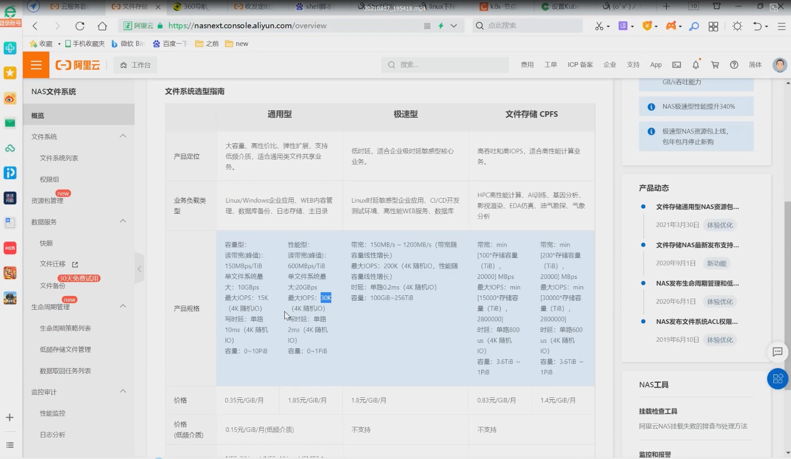

## 实验环境：

    - k8s集群：3台centos7.9 虚拟机，1个master节点,2个node节点
      k8s version：v1.20
搭建 k8s 集群：可以参考 [k8s部署安装.md](https://github.com/aa297236041/K8s-/blob/main/k8s%E9%83%A8%E7%BD%B2%E5%AE%89%E8%A3%85.md)


## 理论基础

1.数据持久化的目的

    通常情况下，容器运行起来后，写入到其容器内部的文件是暂时性的。当容器崩溃后，k8s将这个容器kill掉，然后生成一个新的容器，
    此时，新运行的容器将没有原来容器内的文件，因为容器是从镜像重新创建的。 （容器一旦重启或者被删除了，里面存放的数据是会被销毁的）
    数据共享：同一个pod中运行的容器之间，经常会存在共享文件或目录的需求，比如采集容器和主容器

2.生命周期

    k8s里面的volume数据卷存在明确的生命周期，并且volume的生命周期比同一容器组pod中的任意容器的生命周期都要长。
    不管容器本身重启了多少次，数据都被保留下来。当然，pod如果不存在了，数据卷自然就退出了。

注意：可以定义pod所使用的数据卷类型不同，数据可能随着数据卷的退出而删除，也可能被真正的持久化，即使后期重新使用容器时仍然可以使用该数据卷，下面有例子。

3.pv和pvc

    数据卷在k8s生产中用的最多的还是PV和PVC (PersistentVolume和PersistentVolumeClaim)。在企业里面，PV由运维工程师来进行维护（存储工程师），
    而PVC则是由开发人员自己申请使用即可。其中PV是具有持久性的，生命周期独立于Pod，研发人员需要进行一个容器的数据卷挂载，那么写一个PVC来绑定PV就可以了，k8s自身会查找符合条件的PV。
    有了pvc，我们在K8s进行卷挂载就只需要考虑要多少容量了，而不用关心真正的空间是用什么存储系统做的等一些底层细节信息，pv这些只有存储管理员才应用去关心它。
    K8s支持多种类型的pv，我们这里就以生产中常用的NFS来作演示（在云上的话就用NAS，我们使用了阿里云的NAS），
    生产中如果对存储要求不是太高的话，建议就用NFS，这样出问题也比较容易解决，如果有性能需求，可以看看rook的ceph。

这里列出了阿里云的NAS相关的性能，价格信息，供大家参考

    1.通用型NAS存储(性价比高，可以存放web内容管理，数据库备份，日志存储等。)：

    通用型：容量是1~10PB，读带宽150MBps/TiB，最大IOPS是15K。价格是0.35元/GiB/月
    性能型：容量是1PB，读带宽600MBps/TiB，最大IOPS是30K。价格是1.85元/GiB/月
    
    2.极速型NAS(低时延，高性能WEB服务，数据库)：

    容量：100GiB256TiB，带宽150MB/s 1200MB/s，最大IOPS是200K，时延0.2ms。价格是1.8元/GiB/月

   
   
## 开始实验
  搭建一个nfs存储（注意：本次复用k8s-master节点作为nfs server端来提供nfs服务，如果你有NAS服务器可以用不用创建）
  ```bash
  # 在nfs server服务端节点(k8s-master)安装
[root@k8s-master ~]# yum install nfs-utils -y
[root@k8s-master ~]# mkdir /nfs
[root@k8s-master ~]# cho "/nfs *(rw,insecure,sync,no_root_squash)" > /etc/exports
[root@k8s-master ~]# systemctl enable rpcbind nfs-utils nfs-server --now
 
# 检测一下
[root@k8s-master ~]# showmount -e 172.29.9.31
Export list for 172.29.9.31:
/nfs *
[root@k8s-master ~]#
```
nfs server端配置完成后，可以在其他的机器上挂在检测一下

```bash
#本次在k8s-node1上验证下nfs server提供的nfs服务是否正常
用下面这个命令验证下：
mount -t nfs -o vers=3,nolock,proto=tcp,rsize=1048576,wsize=1048576,hard,timeo=600,retrans=2,noresvport 172.29.9.31:/nfs /opt
 
#如果是报下面这个错误的话，是因为nfs client也是需要安装nfs-utils包的，要不这个测试命令用不了的。
#最后，特别注意：无论nfs客户端还是服务端均要安装nfs-utils软件包的，否则后期pod创建会报错的！！！
[root@k8s-node1 ~]# mount -t nfs -o vers=3,nolock,proto=tcp,rsize=1048576,wsize=1048576,hard,timeo=600,retrans=2,noresvport 172.29.9.31:/nfs /opt
mount: wrong fs type, bad option, bad superblock on 172.29.9.31:/nfs,
       missing codepage or helper program, or other error
       (for several filesystems (e.g. nfs, cifs) you might
       need a /sbin/mount.<type> helper program)
 
       In some cases useful info is found in syslog - try
       dmesg | tail or so.
[root@k8s-master ~]#
 
#安装nfs-utils
[root@k8s-node1 ~]# yum install -y nfs-utils
 
#再次用命令测试nfs 服务是否正常
[root@k8s-node1 ~]# mount -t nfs -o vers=3,nolock,proto=tcp,rsize=1048576,wsize=1048576,hard,timeo=600,retrans=2,noresvport 172.29.9.31:/nfs /opt
#可以看到nfs服务一切正常
[root@k8s-node1 ~]# df|grep nfs 
172.29.9.31:/nfs         17811456 6279424  11532032  36% /opt
[root@k8s-node1 ~]# mount|grep nfs
sunrpc on /var/lib/nfs/rpc_pipefs type rpc_pipefs (rw,relatime)
172.29.9.31:/nfs on /opt type nfs (rw,relatime,vers=3,rsize=262144,wsize=262144,namlen=255,hard,nolock,noresvport,proto=tcp,timeo=600,retrans=2,sec=sys,mountaddr=172.29.9.31,mountvers=3,mountport=20048,mountproto=tcp,local_lock=all,addr=172.29.9.31)
[root@k8s-node1 ~]#
 
 
#我们可以顺便写几个文件测测下效果：
[root@k8s-node1 ~]# df -hT|grep nfs
172.29.9.31:/nfs        nfs        17G  6.0G   11G  36% /opt
[root@k8s-node1 ~]# cd /opt/
[root@k8s-node1 opt]# ls
[root@k8s-node1 opt]# echo node2 > node2.txt #在node2 nfs client的nfs目录下写一个文件
[root@k8s-node1 opt]#
[root@k8s-node1 opt]# exit
logout
Connection to k8s-node1 closed.
[root@k8s-master ~]# cd /nfs/ #然后再nfs serrver端的nfs目录下就可以看见这个文件了，说明我们的nfs服务时没有问题的
[root@k8s-master nfs]# ls
node2.txt
[root@k8s-master nfs]# cat node2.txt
node2
[root@k8s-master nfs]#
 
 
#测试nfs正常后，我们这里把刚挂载的nfs给卸载掉
[root@k8s-node1 ~]# df -hT|grep nfs
172.29.9.31:/nfs        nfs        17G  6.0G   11G  36% /opt
[root@k8s-node1 ~]# umount /opt/
[root@k8s-node1 ~]# df -hT|grep nfs
[root@k8s-node1 ~]#
```
nfs服务搭建成功后，我们就可以来测试pv、pvc的实验了。

    问题：测试pv,pvc实验时，需要把刚才测试nfs服务可用性时挂载的目录给卸载吗？
    答案：可以去掉，也可以不去掉。一般情况是需要去掉的，当时我们只是测试下nfs服务的可用性而已。并且我们只要保证k8s节点均能使用nfs服务即可。
    记得，节点上要安装nfs-utils软件包哦。
    
创建基于NFS的PV

    我们先来查看下当前k8s集群环境，保证本次实验环境纯净：
  ```bash
  [root@k8s-master ~]# kubectl get po,deploy,svc,pv,pvc #可以看到，当前k8s集群环境是ok的
NAME                 TYPE        CLUSTER-IP   EXTERNAL-IP   PORT(S)   AGE
service/kubernetes   ClusterIP   10.96.0.1    <none>        443/TCP   166d
[root@k8s-master ~]#
```

创建pv的yaml文件

```bash
[root@k8s-master ~]# vim pv.yaml
apiVersion: v1
kind: PersistentVolume
metadata:
  name: pv1
  labels:
    type: k8s-claim # <----------  0	
spec:
  capacity:
    storage: 1Gi # <----------  1
  accessModes: ["ReadWriteOnce"] # <----------  2
  persistentVolumeReclaimPolicy: Recycle # <----------  3
  storageClassName: nfs # <----------  4
  nfs:
    path: /nfs/pv1 # <----------  5
    server: 172.29.9.31    
 ```
 对上面的yaml文件我们做个说明：
 
    0、labels:
      type: k8s-claim    # 这里建议打上一个独有的标签，在多个pv的时候方便提供pvc选择挂载，工作中一般上打标签格式是：项目组-团队名-pv名
    1、capacity是指定pv的容量是1G
    2、accessModes是指定的访问模式，支持的访问模式有: 
	ReadWriteOnce表示PV能以read-write模式mount到单个节点
	ReadOnlyMany表示pv有read-only只读模式mount到多个节点
	ReadWriteMany表示pv以read-write模式mount到多个节点
 
    3、persistentVolumeReclaimPolicy 指定当PV的回收策略，有三种方式:#研发使用完后，就会删除pvc，删除pvc后就会有3个动作
	Retain: 删除容器之后，但是pv由管理员手工回收，安全级别比较高 #工作环境中一般常用的是`retain`
	Recycle：删除容器之后，清除PV中的数据，效果相当于执行了rm -rf /nfs/pv1/*
	Delete：删除容器之后，删除整个PV对应的存储资源，不推荐!!!
 
    4、storageClassName是指定PV的class为我们这里定义的nfs，相当于为PV设置了一个分类，`pvc可以指定class申请相应class的pv`。
    举个例子：开发去申请2G大小的pvc，那么符合pvc条件的pv有两种。一种是高速存储Gclass，一种是低速存储Lclass，开发申请的2G是用于数据库，那么需要高速存储，此时定义storageClassName为Gclass，所以pvc会自动去找Gclass。
 
    这里有个坑，`就是PVC里面的storageClassName必须和PV里面的storageClassName保持一致`。
    #我们可以看到，pvC的限制非常多，都要符合pv的条件才行；
  另外：这里需要先指定PV在NFS服务器上对应的目录，这里注意，需要手动提前创建好这个目录并授权，否则后面挂载会提示目录不存在。授权的用户及用户组是nobody #这里需要注意下。
  
  ```bash
  [root@k8s-master ~]# cat /etc/passwd|grep nobody
nobody:x:99:99:Nobody:/:/sbin/nologin
nfsnobody:x:65534:65534:Anonymous NFS User:/var/lib/nfs:/sbin/nologin
[root@k8s-master ~]# mkdir /nfs/pv1
[root@k8s-master ~]# chown -R nobody.nobody /nfs/pv1/
[root@k8s-master ~]# chown -R nobody.nobody /nfs/
[root@k8s-master ~]# ll -d /nfs/ /nfs/pv1/
drwxr-xr-x 3 nobody nobody 34 Nov 16 14:29 /nfs/
drwxr-xr-x 2 nobody nobody  6 Nov 16 14:29 /nfs/pv1/
[root@k8s-master ~]#
```

创建PV
```bash
# 部署pv
[root@k8s-master ~]#kubectl apply -f pv.yaml
persistentvolume/pv1 created
 
# 查看pv的状态
[root@k8s-master ~]#kubectl get pv
NAME   CAPACITY   ACCESS MODES   RECLAIM POLICY   STATUS      CLAIM   STORAGECLASS   REASON   AGE
pv1    1Gi        RWO            Recycle          Available           nfs                     5s
[root@k8s-master ~]#
 
# 注意：查看STATUS字段，只有为Available字段才可以正常使用，被pvc申请
```
创建基于NFS的PVC

```bash
vim pvc.yaml


apiVersion: v1
kind: PersistentVolumeClaim
metadata:
  name: pvc1	#  <----------4
 
spec:
  accessModes: ["ReadWriteOnce"]	# <----------0
  resources:
    requests:
      storage: 1Gi	# <----------1
  storageClassName: nfs	# <----------2
  selector:
    matchLabels:
      type: k8s-claim    # <----------3   
```
 接下来我们对上面的参数做一个说明
 
 ```bash
 0、accessModes是指定的访问模式，跟我们上面解释的一个道理，需要注意，`pv里面是什么模式，这里也要写对应的模式`
1、storage存储大小，与pv里面保持一致
2、storageClassName名字，至少和某个pv的storageClassName保持一致，否则找不到对应的分类
3、matchLabels: 这是匹配的pv的标签，标签在k8s里面非常重要的一个概念
4、metadata：pvc的标签，后面挂载成功后会用到
 ```
 
 创建pvc
 
 ```bash
 # 应用pvc.yaml配置文件
[root@k8s-master ~]#kubectl apply -f pvc.yaml
persistentvolumeclaim/pvc1 created
 
# 获取pvc状态
[root@k8s-master ~]#kubectl get pvc
NAME   STATUS   VOLUME   CAPACITY   ACCESS MODES   STORAGECLASS   AGE
pvc1   Bound    pv1      1Gi        RWO            nfs            53s
[root@k8s-master ~]#
# 主要是看STATUS字段，当表示Bound代表成功找到pv并成功绑定
 
# 此时再去看pv的状态
[root@k8s-master ~]#kubectl get pv
NAME   CAPACITY   ACCESS MODES   RECLAIM POLICY   STATUS   CLAIM          STORAGECLASS   REASON   AGE
pv1    1Gi        RWO            Recycle          Bound    default/pvc1   nfs                     12m
[root@k8s-master ~]#
# 可以看到pv的STATUS字段显示Bound，而且CLAIM字段提示被default/pvc所消费
 ```
 
 创建Pod应用挂载pvc
 
 ```bash
 
 vim nginx.yaml
 
 apiVersion: v1
kind: Service
metadata:
  name: nginx
  labels:
    app: nginx
spec:
  ports:
  - port: 80
    protocol: TCP
    targetPort: 80
  selector:
    app: nginx
 
---
apiVersion: apps/v1
kind: Deployment
metadata:
  name: nginx
  labels:
    app: nginx
spec:
  replicas: 1
  selector:
    matchLabels:
      app: nginx
  template:
    metadata:
      labels:
        app: nginx
    spec:
      containers:
      - name: nginx
        image: nginx
        volumeMounts: # 我们这里将nginx容器默认的页面目录挂载
        - name: html-files # 与下面的volumes的name保持一致
          mountPath: "usr/share/nginx/html"
 
      volumes:
      - name: html-files
        persistentVolumeClaim:  # 卷类型使用pvc,同时下面名称处填先创建好的pvc1
          claimName: pvc1
 
 ```
 
创建对应存储上面的资源
在实际的工作环境当中，创建一个相对应的web服务之前已经准备好了访问的资源，等容器创建完毕，就可以立马访问了。

```bash
# 先在对应的存储上创建访问的资源
[root@k8s-master ~]#cd /nfs/pv1/
[root@k8s-master pv1]#echo 'HelloWorld' > index.html
```

创建nginx的pod和service

```bash
[root@k8s-master ~]#kubectl apply -f nginx.yaml
service/nginx created
deployment.apps/nginx created
[root@k8s-master ~]#
```
等待这个pod资源创建完毕

```bash
[root@k8s-master ~]#kubectl get po,deploy,svc
NAME                       READY   STATUS    RESTARTS   AGE
pod/nginx-ffc5548d-48zwj   1/1     Running   0          30s
 
NAME                    READY   UP-TO-DATE   AVAILABLE   AGE
deployment.apps/nginx   1/1     1            1           30s
 
NAME                 TYPE        CLUSTER-IP    EXTERNAL-IP   PORT(S)   AGE
service/kubernetes   ClusterIP   10.96.0.1     <none>        443/TCP   167d
service/nginx        ClusterIP   10.97.70.55   <none>        80/TCP    30s
[root@k8s-master ~]#

```

访问一下

```bash
~]# curl http://svc地址
 
[root@k8s-master ~]#curl 10.97.70.55
HelloWorld
[root@k8s-master ~]#
```

进入容器内部修改index.html文件(不建议)，再次访问查看效果：

```bash
[root@k8s-master ~]#kubectl get po
NAME                   READY   STATUS    RESTARTS   AGE
nginx-ffc5548d-48zwj   1/1     Running   0          3m13s
[root@k8s-master ~]#kubectl exec -it nginx-ffc5548d-48zwj -- bash
root@nginx-ffc5548d-48zwj:/# echo 222222 >> /usr/share/nginx/html/index.html
root@nginx-ffc5548d-48zwj:/# exit
exit
[root@k8s-master ~]#cat /nfs/pv1/index.html
HelloWorld
222222
[root@k8s-master ~]#
#以上符合预期效果。
```
看的出来容器里面的修改都会保存到nfs存储上。

    有的同学访问403的原因和解决方法

    没有在nfs存储创建相应的资源导致的。主要是容器里面的/usr/share/nginx/html目录下的内容挂载后被覆盖了，所以没有index.html文件

在nginx的pod所在的节点执行下面的命令可以查看相关的挂载信息

```bash
#查看次pod被调度在了k8s-node1节点上了
[root@k8s-master ~]#kubectl get po -owide
NAME                   READY   STATUS    RESTARTS   AGE     IP              NODE        NOMINATED NODE   READINESS GATES
nginx-ffc5548d-48zwj   1/1     Running   0          4m56s   10.244.36.122   k8s-node1   <none>           <none>
[root@k8s-master ~]#
#到k8s-node1节点上可以看到次pod的挂载信息的
[root@k8s-node1 ~]#mount -l|grep nfs
sunrpc on /var/lib/nfs/rpc_pipefs type rpc_pipefs (rw,relatime)
172.29.9.31:/nfs/pv1 on /var/lib/kubelet/pods/91246cf2-5a69-4e93-999b-5166be2a12b6/volumes/kubernetes.io~nfs/pv1 type nfs4 (rw,relatime,vers=4.1,rsize=262144,wsize=262144,namlen=255,hard,proto=tcp,timeo=600,retrans=2,sec=sys,clientaddr=172.29.9.32,local_lock=none,addr=172.29.9.31)
[root@k8s-node1 ~]#
#是可以看到index.html文件的内容的
[root@k8s-node1 ~]#ls /var/lib/kubelet/pods/91246cf2-5a69-4e93-999b-5166be2a12b6/volumes/kubernetes.io~nfs/pv1/
index.html
[root@k8s-node1 ~]#cat  /var/lib/kubelet/pods/91246cf2-5a69-4e93-999b-5166be2a12b6/volumes/kubernetes.io~nfs/pv1/index.html
HelloWorld
222222
[root@k8s-node1 ~]#
# 在nfs-server端执行，也是可以查看存储目录相关信息的
fuser -mv  /nfs/pv1 #注意：这个fuser命令需要安装psmisc-22.20-17.el7.x86_64软件包
[root@k8s-master ~]#yum install -y psmisc-22.20-17.el7.x86_64
[root@k8s-master ~]#fuser -mv  /nfs/pv1|grep nfs
                     USER        PID ACCESS COMMAND
/nfs/pv1:            root      mount /
                     root      knfsd /nfs
                     root      .rce. systemd
                     root      .rc.. kthreadd
                     root      .rc.. ksoftirqd/0
                     root      .rc.. kworker/0:0H
                     root      .rc.. migration/0
                     root      .rc.. rcu_bh
                     root      .rc.. rcu_sched
                     root      .rc.. lru-add-drain
                     root      .rc.. watchdog/0
                     root      .rc.. watchdog/1
                     root      .rc.. migration/1
                     root      .rc.. ksoftirqd/1
                     root      .rc.. kworker/1:0H
                     root      .rc.. netns
                     root      .rc.. khungtaskd
                     root      .rc.. writeback
                     root      .rc.. kintegrityd
                     root      .rc.. bioset
                     root      .rc.. bioset
                     root      .rc.. bioset
                     root      .rc.. kblockd
                     root      .rc.. md
                     root      .rc.. edac-poller
                     root      .rc.. watchdogd
                     root      .rc.. kswapd0
                     root      .rc.. ksmd
                     root      .rc.. khugepaged
                     root      .rc.. crypto
                     root      .rc.. kthrotld
                     root      .rc.. kmpath_rdacd
                     root      .rc.. kaluad
                     root      .rc.. kpsmoused
                     root      .rc.. ipv6_addrconf
                     root      .rc.. deferwq
                     root      .rc.. kauditd
                     root      .rc.. nfit
                     root      .rc.. ata_sff
                     root      .rc.. mpt_poll_0
                     root      .rc.. mpt/0
                     root      .rc.. scsi_eh_0
                     root      .rc.. scsi_tmf_0
                     root      .rc.. scsi_eh_1
                     root      .rc.. scsi_tmf_1
                     root      .rc.. scsi_eh_2
                     root      .rc.. scsi_tmf_2
                     root      .rc.. ttm_swap
                     root      .rc.. irq/16-vmwgfx
                     root      .rc.. kworker/1:0
                     root      .rc.. kdmflush
                     root      .rc.. bioset
                     root      .rc.. kdmflush
                     root      .rc.. bioset
                     root      .rc.. bioset
                     root      .rc.. xfsalloc
                     root      .rc.. xfs_mru_cache
                     root      .rc.. xfs-buf/dm-0
                     root      .rc.. xfs-data/dm-0
                     root      .rc.. xfs-conv/dm-0
                     root      .rc.. xfs-cil/dm-0
                     root      .rc.. xfs-reclaim/dm-
                     root      .rc.. xfs-log/dm-0
                     root      .rc.. xfs-eofblocks/d
                     root      .rc.. xfsaild/dm-0
                     root      .rc.. kworker/1:1H
                     root      .rce. systemd-journal
                     root      .rce. lvmetad
                     root      frce. systemd-udevd
                     root      .rc.. kworker/0:1H
                     root      .rc.. xfs-buf/sda1
                     root      .rc.. xfs-data/sda1
                     root      .rc.. xfs-conv/sda1
                     root      .rc.. xfs-cil/sda1
                     root      .rc.. xfs-reclaim/sda
                     root      .rc.. xfs-log/sda1
                     root      .rc.. xfs-eofblocks/s
                     root      .rc.. xfsaild/sda1
                     root      .rc.. rpciod
                     root      .rc.. xprtiod
                     root      Frce. auditd
                     root      .rce. systemd-logind
                     root      .rce. irqbalance
                     root      Frce. VGAuthService
                     root      Frce. vmtoolsd
                     dbus      .rce. dbus-daemon
                     root      Frce. gssproxy
                     polkitd   .rce. polkitd
                     root      .rce. crond
                     root      .rce. login
                     root      .rc.. kworker/1:2
                     root      .rce. sshd
                     root      Frce. tuned
                     root      Frce. rsyslogd
                     root      Frce. kubelet
                     root      Frce. containerd
                     root      Frce. dockerd
                     root      Frce. master
                     postfix   .rce. qmgr
                     root      .rce. ssh
                     root      .rc.. kworker/1:1
                     root      .r.e. containerd-shim
                     root      .r.e. containerd-shim
                     root      .r.e. containerd-shim
                     root      ....m pause
                     root      ....m pause
                     root      ....m pause
                     root      .rce. grep
                     root      .r.e. containerd-shim
                     root      ....m pause
                     root      .r.e. containerd-shim
                     root      F...m etcd
                     root      .r.e. containerd-shim
                     root      ....m pause
                     root      .r.e. containerd-shim
                     root      ....m pause
                     root      .r.e. containerd-shim
                     root      ....m kube-proxy
                     root      .r.e. containerd-shim
                     root      ....m pause
                     root      .r.e. containerd-shim
                     polkitd   ....m kube-controller
                     root      .r.e. containerd-shim
                     root      .r.e. containerd-shim
                     root      ....m pause
                     root      ....m pause
                     root      .r.e. containerd-shim
                     root      .r.e. containerd-shim
                     root      ....m pause
                     root      ....m pause
                     root      .rc.. kworker/0:1
                     rpc       .rce. rpcbind
                     rpcuser   .rce. rpc.statd
                     root      .rce. rpc.idmapd
                     root      frce. rpc.mountd
                     root      .rc.. nfsd4_callbacks
                     root      .rc.. lockd
                     root      .rc.. nfsd
                     root      .rc.. nfsd
                     root      .rc.. nfsd
                     root      .rc.. nfsd
                     root      .rc.. nfsd
                     root      .rc.. nfsd
                     root      .rc.. nfsd
                     root      .rc.. nfsd
                     root      .rc.. kworker/u256:0
                     root      .r.e. containerd-shim
                     root      ....m kube-controller
                     root      .r.e. containerd-shim
                     root      .r.e. containerd-shim
                     (unknown)  F...m metrics-sidecar
                     root      ....m kube-scheduler
                     root      .r.e. containerd-shim
                     root      .r.e. containerd-shim
                     root      ....m coredns
                     root      ....m coredns
                     root      .r.e. containerd-shim
                     root      ....m kube-apiserver
                     root      .r.e. containerd-shim
                     (unknown)  F...m dashboard
                     root      .r.e. containerd-shim
                     root      ....m runsvdir
                     root      ....m runsv
                     root      ....m runsv
                     root      ....m runsv
                     root      ....m runsv
                     root      ....m runsv
                     root      ....m runsv
                     root      ....m calico-node
                     root      ....m calico-node
                     root      ....m calico-node
                     root      ....m calico-node
                     root      ....m bird6
                     root      ....m bird
                     root      .rc.. kworker/u256:1
                     root      .rc.. kworker/0:0
                     root      .rc.. kworker/u257:0
                     root      .rc.. hci0
                     root      .rc.. hci0
                     root      .rc.. kworker/u257:2
                     root      .rce. sshd
                     root      .rce. sshd
                     root      .rce. sftp-server
                     root      .rce. bash
                     postfix   .rce. pickup
                     root      .rce. sshd
                     root      .rce. sshd
                     root      .rce. sftp-server
                     root      .rce. bash
                     root      .rc.. nfsiod
                     root      .rce. bash
[root@k8s-master ~]#
```
模拟容器意外退出
手动删除pod，查看容器里面的修改是否持久化了

```bash
kubectl delete pod xxxxx
curl http://svc地址

#测试过程
[root@k8s-master ~]#kubectl get po,svc
NAME                       READY   STATUS    RESTARTS   AGE
pod/nginx-ffc5548d-dj9t7   1/1     Running   0          2m8s

NAME                 TYPE        CLUSTER-IP    EXTERNAL-IP   PORT(S)   AGE
service/kubernetes   ClusterIP   10.96.0.1     <none>        443/TCP   167d
service/nginx        ClusterIP   10.97.70.55   <none>        80/TCP    16m
[root@k8s-master ~]#kubectl delete pod nginx-ffc5548d-dj9t7
pod "nginx-ffc5548d-dj9t7" deleted
[root@k8s-master ~]#kubectl get po,svc
NAME                       READY   STATUS    RESTARTS   AGE
pod/nginx-ffc5548d-f78lf   1/1     Running   0          31s

NAME                 TYPE        CLUSTER-IP    EXTERNAL-IP   PORT(S)   AGE
service/kubernetes   ClusterIP   10.96.0.1     <none>        443/TCP   167d
service/nginx        ClusterIP   10.97.70.55   <none>        80/TCP    17m
[root@k8s-master ~]#curl 10.97.70.55
HelloWorld
222222
[root@k8s-master ~]#

```
    此时会发现我们之前修改的内容依然保存着，这就是容器由于某些原因意外退出后，数据依然持久化的目的。


回收PVC和PV

```bash
[root@k8s-master ~]#kubectl get pvc
NAME   STATUS   VOLUME   CAPACITY   ACCESS MODES   STORAGECLASS   AGE
pvc1   Bound    pv1      1Gi        RWO            nfs            56m
[root@k8s-master ~]#kubectl delete pvc pvc1
persistentvolumeclaim "pvc1" deleted # 一直卡在这里
 
# 卡着的原因就是因为我们的pod应用正在使用pvc，所以删除不了
# 看下pvc发现STATUS是Terminating删除中的状态，这是因为服务pod还在占用这个pvc使用中
[root@k8s-master ~]#kubectl get pvc
NAME   STATUS        VOLUME   CAPACITY   ACCESS MODES   STORAGECLASS   AGE
pvc1   Terminating   pv1      1Gi        RWO            nfs            57m
[root@k8s-master ~]#
```

接下来我们先删除pod

```bash
# 先访问一把
[root@k8s-master ~]#curl 10.97.70.55
HelloWorld
222222
 
# 删除nginx资源
[root@k8s-master ~]#kubectl delete -f nginx.yaml
service "nginx" deleted
deployment.apps "nginx" deleted
 
#再次查看pvc
[root@k8s-master ~]#kubectl get pvc
No resources found in default namespace.
[root@k8s-master ~]#
# 会发现，删除了nginx资源，pvc这个资源立马就消失了，
 
# 根据先前创建pv时的数据回收策略为Recycle – 清除 PV 中的数据，这时果然先创建的index.html已经被删除了，在生产中要尤其注意这里的模式，注意及时备份数据
[root@k8s-master ~]#ls /nfs/pv1/
[root@k8s-master ~]#
 
# 注意：虽然此时pv是可以再次被pvc来消费的，但根据生产的经验，建议在删除pvc时，也同时把它消费的pv一并删除，然后再重启创建都是可以的
```
至此，以上实验结束，感谢阅读。


## 排错异常
1、创建pvc的时候STATUS状态一直是Pending

a、查看PV里面的accessModes字段和PVC里面的accessModes是否对应上面，如果不对应则会是这种错误

b、PVC的accessModes是否是PV的子集，比如：

```bash
# PV里面的`accessModes`字段如果是集合的写法
accessModes: ["ReadWriteMany","ReadWriteOnce","ReadOnlyMany"]
 
# 此时PVC的写法如下是正确的：
accessModes: ["ReadWriteOnce"]
 
# 如果不在集合里面，则会报错。

```

创建pvc之后，发现pv的CLAIM字段为空

    正常情况下pvc绑定到pv之后，pv的CLAIM字段显示的是对应的PVC的名称，但是现在出现异常，CLAIM字段为空，这可能是pvc和pv的storage字段的大小不一致导致的。

    注意：可能是selector 的label等内容是符合的，但就这个storage的大小不一致，像是绑定成功了，又像是绑定失败了。
    
## 面试题
k8s挂载pv、pvc的流程

    1. 调度器把根据各种调度算法把该POD分配到某个节点，比如node01
    2. Node01上的kubelet等待Volume Manager准备存储设备
    3. PV控制器调用存储插件创建PV并与PVC进行绑定
    4、Kubelet被告知卷已经准备好，开始启动POD，通过映射方式挂载到容器中
    
    
    
<br/>

<br/>

<br/>

<br/>

<br/>

<br/>

<br/>

源文地址：https://blog.csdn.net/weixin_39246554/article/details/121358540


